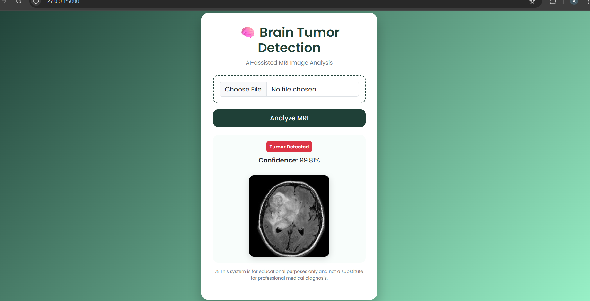
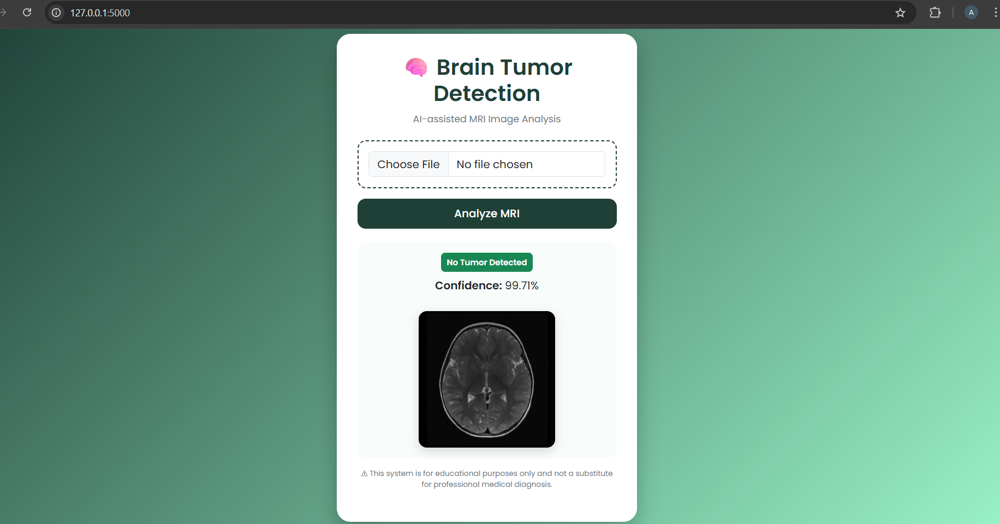

# 🧠 Brain Tumor Detection Using Deep Learning

A web-based application that detects the presence of brain tumors from MRI images using a Convolutional Neural Network (CNN).

---

## 🚀 Features
- Upload MRI image through web interface
- Binary classification: Tumor / No Tumor
- Confidence score for predictions
- Clean, medical-themed UI
- Flask-based deployment

---

## 🛠 Tech Stack
- Python
- TensorFlow / Keras
- Flask
- HTML, CSS, Bootstrap
- NumPy

---

## 📂 Project Structure
Brain-Tumor-Detection/
├── app.py
├── brain_tumor_project.py
├── test_brain_tumor.py
├── requirements.txt
├── README.md
├── .gitignore
├── templates/
│ └── index.html
├── static/
│ ├── uploads/
│ └── screenshots/

---

## 🖼 Screenshots

### Home Page


### Image Upload


### Prediction Result


---

## ⚙ How to Run the Project

```bash
git clone https://github.com/your-username/Brain-Tumor-Detection.git
cd Brain-Tumor-Detection
pip install -r requirements.txt
python app.py
Open browser:
http://127.0.0.1:5000

⚠ Disclaimer

This application is for educational purposes only and is not a substitute for professional medical diagnosis.

📌 Future Improvements

Multi-class tumor classification

Explainable AI (Grad-CAM)

Cloud deployment

